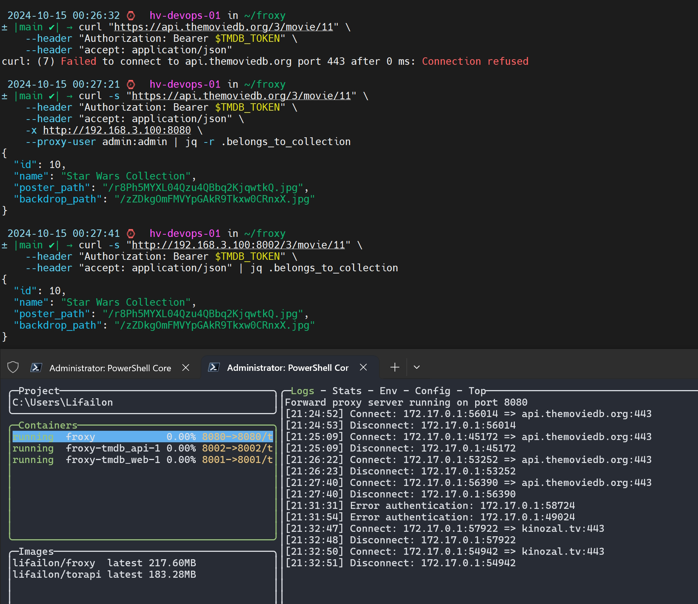
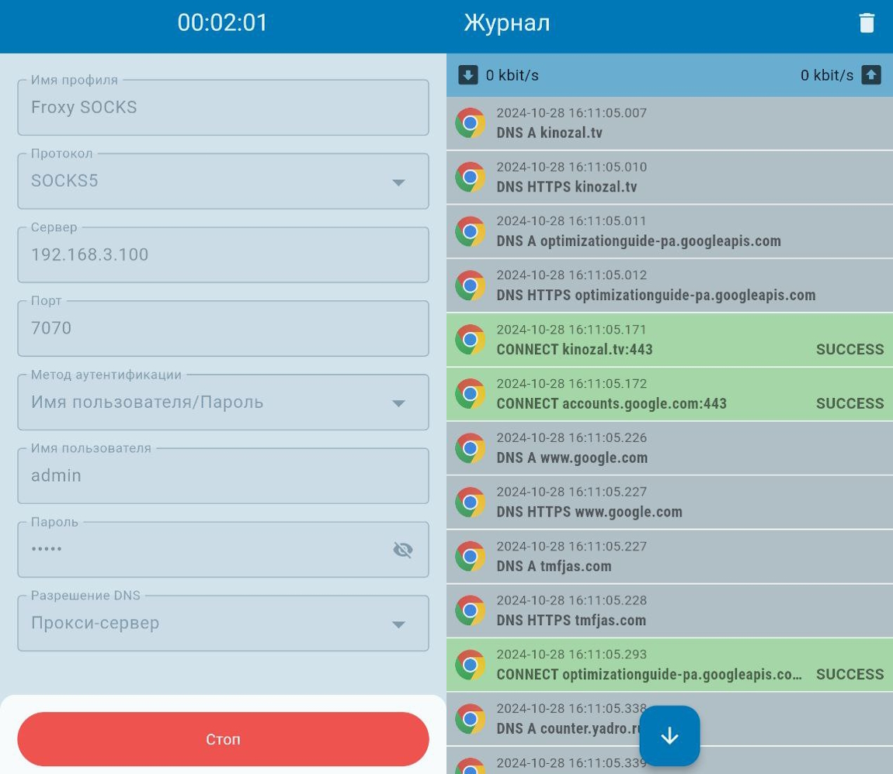
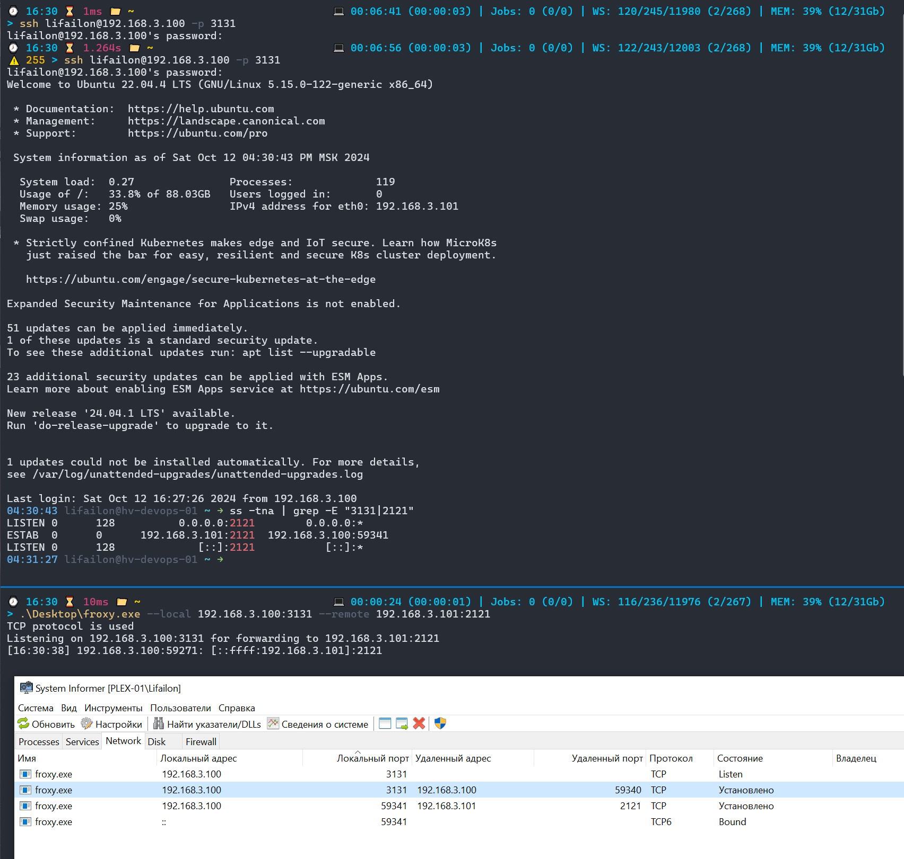
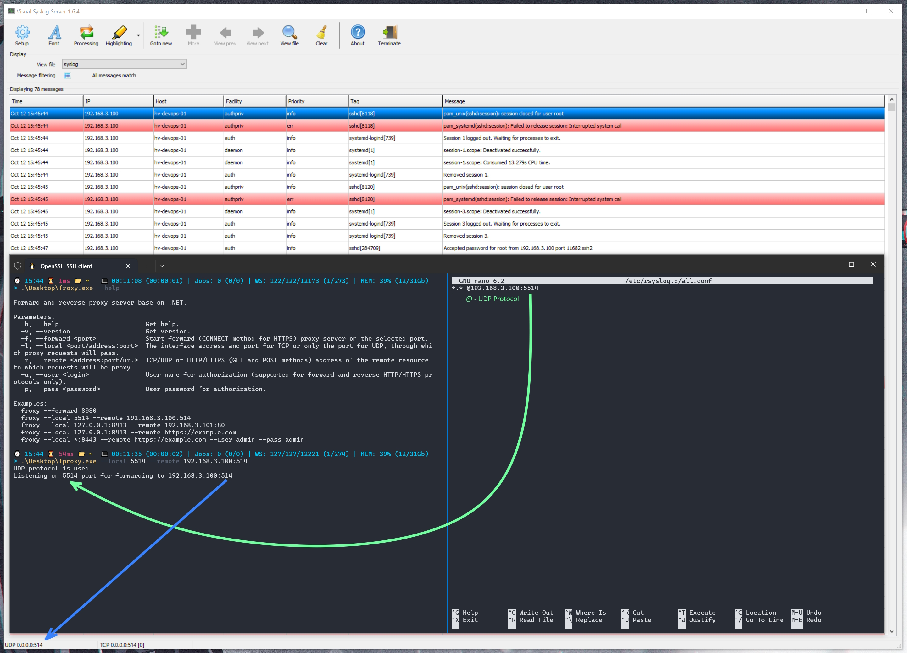

<h1 align="center">
    Froxy
</h1>

<p align="center">
    <a href="https://hub.docker.com/r/lifailon/froxy"></a>
    <a href="https://www.nuget.org/packages/froxy"></a>
</p>

<h4 align="center">
    <strong>English</strong> | <a href="README_RU.md">Русский</a>
</h4>

A cross-platform command line utility for implementing a SOCKS, HTTP and reverse proxy server based on **.NET**. It supports **SOCKS5** protocol for tunneling TCP traffic and **HTTP** protocol for direct (classical) proxying of any **HTTPS** traffic (`CONNECT` requests), as well as **TCP**, **UDP** and **HTTP/HTTPS** protocols for reverse proxying. For web traffic forwarding via reverse proxy, `GET` and `POST` requests are supported, with headers and body of the request passed from the client, which allows to use `API` requests and pass authorization on sites (cookie passing).

- [Installation](#-installation)
- [NuGet](#-nuget)
- [Build](#-build)
- [Docker](#-docker)
- [Usage examples](#-usage)
- - [Forward Proxy](#-forward-proxy)
- - - [SOCKS](#socks)
- - - [HTTP](#http)
- - [Reverse Proxy](#-reverse-proxy)
- - - [TCP](#-tcp)
- - - [SSH Tunneling](#-ssh-tunneling-over-tcp)
- - - [UDP](#-udp)
- - - [HTTP and HTTPS](#-http-and-https)
- - - [Authorization](#-authorization)

## 💁 For what?

What tasks does a reverse proxy server solve:

- **Security**, since the client does not have direct access to the target machine where the application is running, for example, a web server.

- If your Web application or `API` server does not support **authorization**, then you can use [Base64](https://en.wikipedia.org/wiki/Base64) encryption, which requires transmitting authorization data in the request header for all clients that will connect via Proxy. If you use a browser, then a corresponding form for passing basic authorization will be provided.

- Unlike the classic Proxy, you do not need to specify the proxy server address on the client side in the application settings or change the code and use external modules (for example, [proxy-agents](https://github.com/TooTallNate/proxy-agents)) for each request via the API client, but only change the url to the proxy server address.

- If you use a **VPN** service to access a specific URL on the Internet via the `HTTP` or `HTTPS` protocols on your machine, you can provide access to it to other machines on the network, without having to install and use VPN on other clients (for example, on mobile devices the Proxy server address can be specified in the Wi-Fi connection configuration).

- Provide direct access to other hosts in the second subnet, if you use a **VPN** server in point-to-point mode (for example, [Radmin](https://www.radmin-vpn.com)).

- The ability to provide access to an external client in the **DMZ** (Demilitarized Zone) to applications that are located on the internal network, for example, for the `RTSP`, `SSH`, `RDP`, `Syslog` protocols, etc., it is enough to install a proxy with network access to both subnets and provide access through it only to selected applications on different hosts.

- Can act as an alternative to setting up classic **ssh tunneling**, like in `OpenSSH`, `Putty` and others.

There are many alternatives that provide similar functionality separately. For example, **ncat** on Windows (from [nmap](https://github.com/nmap/nmap)), **socat** on Linux for `TCP` or [ReverseProxy](https://github.com/ilanyu/ReverseProxy) on Golang for redirecting HTTP/HTTPS traffic. All of the above functionality is implemented in one utility.

## 🚀 Installation

### 💻 Windows

- [Download and install](https://dotnet.microsoft.com/en-us/download/dotnet/8.0/runtime) .NET application runtime version 8.0.

- [Download](https://github.com/Lifailon/froxy/releases/latest) portable version executable from GitHub repository.

### 🐧 Linux

- Install the .NET Application Runtime:

```shell
sudo apt-get install -y dotnet-runtime-8.0
```

- Download the `froxy` executable file to the `/usr/local/bin/` directory and grant execution permissions:

```shell
arch="x64" # or "arm64"
sudo curl -s -L "https://github.com/Lifailon/froxy/releases/download/0.4.0/froxy-0.4.0-linux-$arch" -o /usr/local/bin/froxy
sudo chmod +x /usr/local/bin/froxy
```

💡 Tested on Ubuntu system.

### No dependency installation

If you don't want to install the `.NET` runtime, you can [download](https://github.com/Lifailon/froxy/releases/latest) a zip archive of the **self-contained** portable version, which already contains all the dependencies (available for both platforms).

## 📦 NuGet

You can install the application from the package manager [NuGet](https://www.nuget.org/packages/froxy):

```shell
dotnet tool install --global froxy  
```

After installation, the application will be available as a `froxy` executable from any location on the system.

Package the application for publication on [NuGet](https://www.nuget.org):

```shell
dotnet pack
```

## 🔨 Build

- Clone the repository:

```shell
git clone https://github.com/Lifailon/froxy
cd froxy/source
```

- Build and run the application:

```shell
dotnet build && dotnet run [parameters]
```

- Build the application into one executable file:

Windows:

```shell
dotnet publish -r win-x64 -c Release /p:PublishSingleFile=true
```

Linux:

```shell
dotnet publish -r linux-x64 -c Release /p:PublishSingleFile=true
```

- Build a self-contained application (without the need to install .NET platform dependencies on the executable system):

Windows:

```shell
dotnet publish -r win-x64 -c Release --self-contained true
```

Linux:

```shell
dotnet publish -r linux-x64 -c Release --self-contained true
```

## 🐳 Docker

Download the built image from [DockerHub](https://hub.docker.com/r/lifailon/froxy):

```shell
docker pull lifailon/froxy:latest
```

To build a container image from project source files, use [dockerfile](dockerfile):

```shell
docker build -t lifailon/froxy .
```

To pre-build the application (if this has not been done previously on the local system), use [dockerfile-pre-build](dockerfile-pre-build):

```shell
docker build -t lifailon/froxy -f dockerfile-pre-build .
```

An example of running a classic proxy server for **HTTP** protocol on port `8080` using authorization in the container:

```shell
port=8080
docker run -d \
    --name froxy \
    -e SOCKS=0 \
    -e FORWARD=$port \
    -e LOCAL="" \
    -e REMOTE="" \
    -e USER="admin" \
    -e PASSWORD="admin" \
    -p $port:$port \
    --restart=unless-stopped \
    lifailon/froxy
```

If you plan to use a reverse proxy, set the value to `SOCKS=0` and `FORWARD=0`, passing the values to the `LOCAL` and `REMOTE` variables instead. If authorization is not required, then pass the value `false` to the `USER` and `PASSWORD` parameters.

An example of starting a reverse proxy server without authorization:

```shell
port=8443
docker run -d \
    --name froxy \
    -e SOCKS=0 \
    -e FORWARD="0" \
    -e LOCAL="*:$port" \
    -e REMOTE="https://kinozal.tv" \
    -e USER="false" \
    -e PASSWORD="false" \
    -p $port:$port \
    --restart=unless-stopped \
    lifailon/froxy
```

You can run multiple instances of an application at the same time, example [docker-compose](docker-compose.yml) for the [TMDB](https://www.themoviedb.org) web interface on port `8081` and **api** on port `8082` without authorization:

```shell
docker-compose -f docker-compose.yml up -d
```

In the example below, the machine does not have direct access to **api**, so the request is made through a proxy and a reverse proxy:



To stop all running services:

```shell
docker-compose down
```

## 📑 Usage

Get Help:

```shell
froxy --help

Forward and reverse proxy server base on .NET.

Parameters:
  -h, --help                       Get help.
  -v, --version                    Get version.
  -s, --socks <port>               Start SOCKS5 proxy server forwarding TCP and UDP traffic via port selected in the 1024-49151 range.
  -f, --forward <port>             Start HTTP proxy server forwarding HTTPS traffic (CONNECT method) via port selected in the 1024-49151 range.
  -l, --local <port/address:port>  The interface address and port for TCP or only the port for UDP, through which proxy requests will pass.
  -r, --remote <address:port/url>  TCP/UDP or HTTP/HTTPS (GET and POST methods) address of the remote resource to which requests will be proxy.
  -u, --user <login>               User name for authorization (supported for forward and reverse HTTP/HTTPS protocols only).
  -p, --pass <password>            User password for authorization.

Examples:
  froxy --socks 1080
  froxy --forward 8080
  froxy --forward 8080 >> froxy.log &
  froxy --local 5514 --remote 192.168.3.100:514
  froxy --local 127.0.0.1:8443 --remote 192.168.3.101:80
  froxy --local 127.0.0.1:8443 --remote https://example.com
  froxy --local *:8443 --remote https://example.com --user admin --pass admin
```

### 📭 Forward Proxy

#### SOCKS

Running the proxy server using the **SOCKS5** protocol on port `7070`, and checking the connection on the Android device via client [Super Proxy](https://play.google.com/store/apps/details?id=com.scheler.superproxy):

```shell
froxy --socks 7070 --user admin --pass admin

SOCKS5 proxy server running on port 7070
[16:10:55] Error authentication: 192.168.3.58:49962
Received username: admin, password: admin2
[16:10:59] Request: 192.168.3.58:49984 => 8.8.8.4:853
[16:11:06] Request: 192.168.3.58:50024 => kinozal.tv:443
[16:11:06] Request: 192.168.3.58:50036 => optimizationguide-pa.googleapis.com:443
[16:11:06] Request: 192.168.3.58:50040 => kinozal.tv:443
[16:11:06] Request: 192.168.3.58:50050 => myroledance.com:443
[16:11:06] Request: 192.168.3.58:57488 => tmfjas.com:443
[16:11:06] Request: 192.168.3.58:57484 => clientservices.googleapis.com:443
[16:11:06] Request: 192.168.3.58:57504 => i124.fastpic.org:443
[16:11:07] Request: 192.168.3.58:57518 => counter.yadro.ru:443
[16:11:07] Request: 192.168.3.58:57532 => klmainprost.com:443
[16:11:08] Request: 192.168.3.58:57546 => tmfjas.com:443
[16:11:09] Request: 192.168.3.58:57562 => fonts.gstatic.com:443
[16:11:09] Request: 192.168.3.58:57564 => readaloud.googleapis.com:443
[16:11:09] Request: 192.168.3.58:57572 => readaloud.googleapis.com:443
[16:11:10] Disconnect: 192.168.3.58:57572
[16:11:11] Disconnect: 192.168.3.58:49984
[16:11:12] Request: 192.168.3.58:57586 => nearbydevices-pa.googleapis.com:443
[16:11:25] Request: 192.168.3.58:46610 => clients4.google.com:443
[16:11:26] Disconnect: 192.168.3.58:57518
[16:11:36] Request: 192.168.3.58:43958 => userlocation.googleapis.com:443
[16:11:37] Disconnect: 192.168.3.58:50024
[16:11:37] Disconnect: 192.168.3.58:50040
...
```



#### HTTP

Running a forwarding proxy on the server for `HTTP` protocol:

```shell
froxy --forward 8080 --user admin --pass admin

Forward proxy server running on port 8080
[14:58:18] Error authentication: 192.168.3.101:47156
[14:58:20] Connect: 192.168.3.101:47170 => kinozal.tv:443
[14:58:20] Disconnect: 192.168.3.101:47170
[14:58:35] Connect: 192.168.3.101:47522 => rutracker.org:443
[14:58:36] Disconnect: 192.168.3.101:47522
```

Sending requests on the client via proxy:

```shell
curl -x http://192.168.3.100:8080 --proxy-user adm:adm https://kinozal.tv/browse.php?s=the+rookie
curl -x http://192.168.3.100:8080 --proxy-user admin:admin https://kinozal.tv/browse.php?s=the+rookie
curl -x http://192.168.3.100:8080 --proxy-user admin:admin https://rutracker.org/forum/index.php
```

You can also run the proxy in daemon mode (background process) and pass the log output to a file:

```shell
froxy --forward 8080 --user admin --pass admin >> froxy.log & 
```

The syntax is the same for both systems (Linux and Windows). It is possible to launch multiple instances to process different requests in reverse proxy mode.

To stop all background processes in Windows:

```PowerShell
Get-Process *froxy* | Stop-Process
```

Linux:

```shell
pkill froxy
```

### ⚡ Reverse Proxy

#### 🔌 TCP

In the example, accepts requests on the interface with IP address `192.168.3.100` and port `8443` to redirect to a remote host with IP address `192.168.3.101`, where the application is running on port `80`.

```shell
froxy --local 192.168.3.100:8443 --remote 192.168.3.101:80

TCP protocol is used
Listening on 192.168.3.100:8443 for forwarding to 192.168.3.101:80
[15:52:01] 192.168.3.100:37865: [::ffff:192.168.3.101]:80
[15:52:04] 192.168.3.100:37160: [::ffff:192.168.3.101]:80
[15:52:21] 192.168.3.99:35036: [::ffff:192.168.3.101]:80
[15:52:22] 192.168.3.99:35037: [::ffff:192.168.3.101]:80
[15:52:25] 192.168.3.99:35035: [::ffff:192.168.3.101]:80
[15:52:30] 192.168.3.100:37162: [::ffff:192.168.3.101]:80
[15:52:34] 192.168.3.100:38970: [::ffff:192.168.3.101]:80
[15:52:35] 192.168.3.100:37999: [::ffff:192.168.3.101]:80
```

💡 To listen to all network interfaces, use the `*` symbol instead of the local IP address (you need to run the console with administrator rights).

This method is suitable for processing most protocols that operate on the basis of TCP, including support for data transmission in the request body via HTTP.

But this method is not suitable for proxying requests to remote resources over the Internet.

```PowerShell
$(Test-NetConnection 172.67.189.243 -Port 443).TcpTestSucceeded
True

froxy--local localhost:8443 --remote 172.67.189.243:443

TCP protocol is used
Error: An invalid IP address was specified.
```

To solve this problem, it is necessary to use proxying via the HTTP or HTTPS protocol.

#### 🚧 SSH tunneling over TCP

Example ssh connection via proxy server:

```shell
froxy --local 192.168.3.100:3131 --remote 192.168.3.101:2121
```

On the client side, we connect to host `192.168.3.101`, through a proxy with address `192.168.3.100`:

```shell
ssh lifailon@192.168.3.100 -p 3131
```



#### 📡 UDP

An example of forwarding requests from a client (the `rsyslog` client configuration on the right) via UDP (one `@` character in the configuration) to the [Visual Syslog server](https://github.com/MaxBelkov/visualsyslog) listening to requests on port `514` through a proxy server that listens for requests on port `5514`.

💡 When using the `UDP` protocol, the local address is not specified.

```shell
froxy --local 5514 --remote 192.168.3.100:514
```



#### 🌐 HTTP and HTTPS

When using proxying using the **HTTP or HTTPS** protocols, you must pass a url address that begins with the name of the protocol `http://` or `https://`.

💡 Data transfer via `GET` and `POST` requests is supported.

In the example, the proxy server accepts requests on the interface with the IP address `192.168.3.100` on port `8443` to redirect to the remote url resource [Kinozal](https://kinozal.tv). The connection is made from a client with the IP address `192.168.3.99` using the `GET` method. Lists all the endpoints that the client contacts to load the home page.

```shell
froxy --local 192.168.3.100:8443 --remote https://kinozal.tv

HTTP protocol is used
Listening on 192.168.3.100:8443 for forwarding to https://kinozal.tv
Not authorization is used
[16:03:43] 192.168.3.99 GET: /
[16:03:43] 192.168.3.99 GET: /pic/0_kinozal.tv.css?v=3.4
[16:03:43] 192.168.3.99 GET: /pic/jquery-3.6.3.min.js?v=1.1
[16:03:43] 192.168.3.99 GET: /pic/use.js?v=3.7
[16:03:43] 192.168.3.99 GET: /pic/logo3.gif
[16:03:43] 192.168.3.99 GET: /pic/emty.gif
[16:03:44] 192.168.3.99 GET: /pic/radio_ban.jpg
[16:03:44] 192.168.3.99 GET: /pic/knz_love.gif
[16:03:44] 192.168.3.99 GET: /i/poster/1/1/1718811.jpg
[16:03:44] 192.168.3.99 GET: /pic/cat/45.gif
[16:03:44] 192.168.3.99 GET: /pic/l_portiere.gif
[16:03:44] 192.168.3.99 GET: /pic/sbg.gif
[16:03:44] 192.168.3.99 GET: /pic/r_portiere.gif
[16:03:44] 192.168.3.99 GET: /pic/cat/17.gif
[16:03:44] 192.168.3.99 GET: /pic/dw2.png
[16:03:44] 192.168.3.99 GET: /pic/status_icons.png
[16:03:44] 192.168.3.99 GET: /pic/srch_l.png
[16:03:44] 192.168.3.99 GET: /pic/srch_r2.png
[16:03:44] 192.168.3.99 GET: /pic/flags_all.png?v=1
[16:03:44] 192.168.3.99 GET: /i/poster/4/1/1772641.jpg
[16:03:44] 192.168.3.99 GET: /i/poster/3/7/541437.jpg
[16:03:44] 192.168.3.99 GET: /pic/cat/11.gif
[16:03:44] 192.168.3.99 GET: /pic/cat/20.gif
[16:03:45] 192.168.3.99 GET: /i/poster/8/0/467680.jpg
[16:03:45] 192.168.3.99 GET: /i/poster/2/1/2040221.jpg
[16:03:45] 192.168.3.99 GET: /pic/cat/8.gif
[16:03:45] 192.168.3.99 GET: /pic/favicon.ico
```

Authorization on the site via `POST` request:

```shell
[16:05:19] 192.168.3.99 POST: /takelogin.php
[16:05:20] 192.168.3.99 GET: /pic/0_kinozal.tv.css?v=3.4
[16:05:20] 192.168.3.99 GET: /pic/ava_m.jpg
[16:05:20] 192.168.3.99 GET: /pic/logo3.gif
[16:05:20] 192.168.3.99 GET: /pic/use.js?v=3.7
[16:05:20] 192.168.3.99 GET: /pic/jquery-3.6.3.min.js?v=1.1
[16:05:21] 192.168.3.99 GET: /pic/minus.gif
[16:05:21] 192.168.3.99 GET: /pic/plus.gif
[16:05:21] 192.168.3.99 GET: /pic/r5.gif
[16:05:21] 192.168.3.99 GET: /pic/bnr_pay_sm.jpg
[16:05:21] 192.168.3.99 GET: /pic/emty.gif
[16:05:21] 192.168.3.99 GET: /pic/srch_l.png
[16:05:21] 192.168.3.99 GET: /pic/r_portiere.gif
[16:05:21] 192.168.3.99 GET: /pic/sbg.gif
[16:05:21] 192.168.3.99 GET: /pic/bgmn.gif
[16:05:21] 192.168.3.99 GET: /pic/srch_r2.png
[16:05:21] 192.168.3.99 GET: /pic/l_portiere.gif
[16:05:21] 192.168.3.99 GET: /pic/flags_all.png?v=1
```

#### 🔓 Authorization

To use authorization on the proxy server side, you must fill in the appropriate parameters at startup. If the client transmits incorrect authorization data, this will be displayed in the log.

```shell
froxy --local 192.168.3.100:8443 --remote https://kinozal.tv --user proxy --pass admin

HTTP protocol is used
Listening on 192.168.3.100:8443 for forwarding to https://kinozal.tv
Authorization is used
[16:07:44] 192.168.3.100 GET: /
[16:07:44] 192.168.3.100 GET: Authorization form sent
[16:07:48] 192.168.3.100 GET: /
[16:07:48] 192.168.3.100 GET: Authorization error
[16:07:49] 192.168.3.100 GET: /
[16:07:49] 192.168.3.100 GET: Authorization form sent
[16:07:53] 192.168.3.100 GET: /
[16:07:54] 192.168.3.100 GET: /pic/0_kinozal.tv.css?v=3.4
[16:07:54] 192.168.3.100 GET: /pic/jquery-3.6.3.min.js?v=1.1
[16:07:54] 192.168.3.100 GET: /pic/use.js?v=3.7
[16:07:54] 192.168.3.100 GET: /pic/logo3.gif
[16:07:54] 192.168.3.100 GET: /pic/emty.gif
[16:07:55] 192.168.3.100 GET: /pic/radio_ban.jpg
[16:07:55] 192.168.3.100 GET: /pic/knz_love.gif
[16:07:55] 192.168.3.100 GET: /i/poster/1/1/1718811.jpg
[16:07:55] 192.168.3.100 GET: /pic/cat/45.gif
[16:07:55] 192.168.3.100 GET: /pic/dw2.png
[16:07:55] 192.168.3.100 GET: /pic/cat/17.gif
[16:07:55] 192.168.3.100 GET: /i/poster/4/1/1772641.jpg
[16:07:55] 192.168.3.100 GET: /i/poster/3/7/541437.jpg
[16:07:55] 192.168.3.100 GET: /pic/cat/11.gif
[16:07:55] 192.168.3.100 GET: /pic/cat/20.gif
[16:07:55] 192.168.3.100 GET: /i/poster/8/0/467680.jpg
[16:07:55] 192.168.3.100 GET: /i/poster/2/1/2040221.jpg
[16:07:55] 192.168.3.100 GET: /pic/cat/8.gif
[16:07:56] 192.168.3.100 GET: /pic/srch_l.png
[16:07:56] 192.168.3.100 GET: /pic/srch_r2.png
[16:07:56] 192.168.3.100 GET: /pic/l_portiere.gif
[16:07:56] 192.168.3.100 GET: /pic/r_portiere.gif
[16:07:56] 192.168.3.100 GET: /pic/sbg.gif
[16:07:56] 192.168.3.100 GET: /pic/status_icons.png
[16:07:56] 192.168.3.100 GET: /pic/flags_all.png?v=1
[16:07:57] 192.168.3.100 GET: /pic/favicon.ico
```

---

## Other projects:

- 🧲 [Kinozal bot](https://github.com/Lifailon/Kinozal-Bot) - Telegram bot that allows you to automate the process of delivering content to your TV using only your phone. Provides a convenient interface for interacting with the torrent tracker [Kinozal](https://kinozal.tv) and the database [TMDB](https://www.themoviedb.org) to track the release date of episodes, seasons and search for actors for each episode , as well as the ability to manage the torrent client [qBittorrent](https://github.com/qbittorrent/qBittorrent) or [Transmission](https://github.com/transmission/transmission) on your computer, being remote from home and from single interface.

- ✨ [TorAPI](https://github.com/Lifailon/TorAPI/blob/main/README_RU.md) - unofficial API (backend) for torrent trackers RuTracker, Kinozal, RuTor and NoNameClub. Used for quick search of distributions, as well as obtaining torrent files, magnet links and detailed information about distribution by movie title, TV series or distribution ID, and also provides RSS news feed for all providers.

- 🔎 [LibreKinopoisk](https://github.com/Lifailon/LibreKinopoisk) - Google Chrome extension that adds buttons to the Kinopoisk website and provides a **TorAPI** interface in the [Jackett](https://github.com/Jackett/Jackett) style (without the need to install a server part and use a VPN) for quickly searching for movies and series in open sources.

- ❤️ [WebTorrent Desktop api](https://github.com/Lifailon/webtorrent-desktop-api) - fork of the [WebTorrent Desktop](https://github.com/webtorrent/webtorrent-desktop) client, which added a remote control mechanism via the `REST API` based on [Express Framework](https://github.com/expressjs/express).