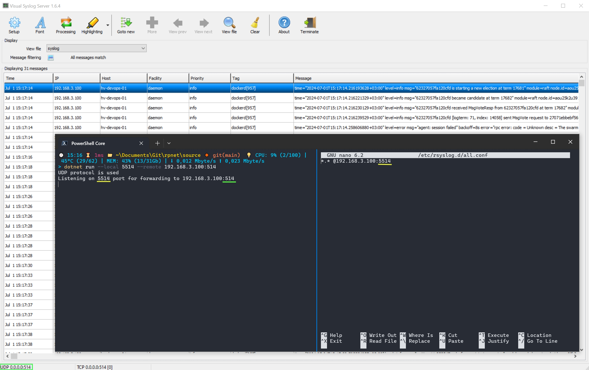

<h1 align="center">
    Reverse Proxy .NET
</h1>

<p align="center">
    <a href="https://github.com/Lifailon/rpnet"></a>
    <a href="https://www.nuget.org/packages/reverse.proxy.net"></a>
    <a href="https://github.com/Lifailon/rpnet"></a>
    <a href="https://github.com/Lifailon/rpnet/blob/rsa/LICENSE"></a>
</p>

➡️ [Choose language](https://github.com/Lifailon/rpnet/blob/rsa/README.md) ➡️‍ [Выберите язык](https://github.com/Lifailon/rpnet/blob/rsa/README_RU.md)

A cross-platform command line utility for implementing a .NET-based reverse proxy. It is used to provide access to hosts from one network interface to remote applications via **TCP, UDP or HTTP/HTTPS** protocols accessible through another network interface without unnecessary settings and with authorization support.

## 💁 For what?

This utility solves several problems:

- Firstly, this is security, because when connecting, the client does not have direct access to the machine and convenience, where, unlike a classic Proxy server, you do not need to configure the server part and specify the proxy server address on the client side in the application settings or every time you access via REST client.

- Secondly, if you are using a VPN server in point-to-point mode or using network separation, where you need to provide access to a client in the DMZ (Demilitarized Zone) to an application listening for connections on a `TCP` or `UDP` port on the internal network, for example , for protocols `RTSP`, `SSH`, `RDP`, `Syslog` and others. This tool can also act as an alternative to classic ssh tunneling (for example, through `OpenSSH` or `Putty`).

- Thirdly, if you use a VPN to access a specific URL resource via the `HTTP` or `HTTPS` protocols on your machine, and want to provide access to it to other machines on the network without using VPN or Proxy servers.

- Fourthly, if your Web application or REST API server does not support authorization, then you can use [Base64](https://en.wikipedia.org/wiki/Base64) encryption, which obliges you to transmit authorization data in the request header for everyone clients that will connect via Proxy. If you are using a browser, a form will be provided to complete basic authorization.

There are many alternatives that provide similar functionality individually. For example, `ncat` on Windows (from [nmap](https://github.com/nmap/nmap)) and `socat` on Linux for TCP or [ReverseProxy](https://github.com/ilanyu/ReverseProxy) in Golang to redirect HTTP/HTTPS traffic. All of the above functionality is implemented in one utility `rpnet`.

## 🚀 Installation

### 💻 Windows

- [Download and install](https://dotnet.microsoft.com/en-us/download/dotnet/8.0/runtime) .NET application runtime version 8.0.

- [Download](https://github.com/Lifailon/rpnet/releases/latest) portable version executable from GitHub repository.

### 🐧 Linux

> 💡 Tested on Ubuntu 22.04.

- Install the .NET Application Runtime:

```shell
sudo apt-get install -y dotnet-runtime-8.0
```

- Download the `rpnet` executable file to the `/usr/local/bin/` directory and grant execution permissions:

```shell
sudo curl -s -L https://github.com/Lifailon/rpnet/releases/download/0.0.2/rpnet-linux-x64-0.0.2 -o /usr/local/bin/rpnet
sudo chmod +x /usr/local/bin/rpnet
```

### 🔨 Build

#### Clone the repository:

```
git clone https://github.com/Lifailon/rpnet.git
cd rpnet
```
#### Start the application:

```
dotnet run [parameters]
```

#### Build the application into one executable file:

- Windows:

```
dotnet publish -r win-x64 -c Release /p:PublishSingleFile=true
```

- Linux:

```
dotnet publish -r linux-x64 -c Release /p:PublishSingleFile=true
```

#### Build a self-contained application (without the need to install .NET platform dependencies on the executable system):

- Windows:

```
dotnet publish -r win-x64 -c Release --self-contained true
```

- Linux:

```
dotnet publish -r linux-x64 -c Release --self-contained true
```

## 📑 Usage

Get Help:

```shell
rpnet.exe --help

Reverse Proxy server base on .NET.

Parameters:
  -h, --help                       Show help.
  -l, --local <port/address:port>  Address and port of the interface or only the port (for udp) through which proxy requests will pass.
  -r, --remote <address:port/url>  TCP/UDP or HTTP/HTTPS address of the remote resource to which requests will be proxy.
  -u, --userName <LOGIN>           User name for authorization (HTTP only).
  -p, --password <PASSWORD>        User password for authorization.

Examples:
  rpnet.exe --local 127.0.0.1:8443 --remote 192.168.3.101:80
  rpnet.exe --local 5514 --remote 192.168.3.100:514
  rpnet.exe --local 127.0.0.1:8443 --remote https://kinozal.tv
  rpnet.exe --local *:8443 --remote https://kinozal.tv --userName proxy --password admin
```

### 🔌 TCP

In the example, accepts requests on the interface with IP address `192.168.3.100` and port `8443` to redirect to a remote host with IP address `192.168.3.101`, where the application is running on port `80`.

```shell
rpnet.exe --local 192.168.3.100:8443 --remote 192.168.3.101:80

TCP protocol is used
Listening on 192.168.3.100:8443 for forwarding to 192.168.3.101:80
[15:52:01] 192.168.3.100:37865: [::ffff:192.168.3.101]:80
[15:52:04] 192.168.3.100:37160: [::ffff:192.168.3.101]:80
[15:52:21] 192.168.3.99:35036: [::ffff:192.168.3.101]:80
[15:52:22] 192.168.3.99:35037: [::ffff:192.168.3.101]:80
[15:52:25] 192.168.3.99:35035: [::ffff:192.168.3.101]:80
[15:52:30] 192.168.3.100:37162: [::ffff:192.168.3.101]:80
[15:52:34] 192.168.3.100:38970: [::ffff:192.168.3.101]:80
[15:52:35] 192.168.3.100:37999: [::ffff:192.168.3.101]:80
```

> 💡 To listen to all network interfaces, use the `*` symbol instead of the local IP address (you need to run the console with administrator rights).

This method is suitable for processing most protocols that operate on the basis of TCP, including support for data transmission in the request body via HTTP.

But this method is not suitable for proxying requests to remote resources over the Internet.

```PowerShell
$(Test-NetConnection 172.67.189.243 -Port 443).TcpTestSucceeded
True

rpnet.exe--local localhost:8443 --remote 172.67.189.243:443

TCP protocol is used
Error: An invalid IP address was specified.
```

### 📡 UDP

An example of redirecting requests from a client (`rsyslog` configuration) to the [Syslog server](https://github.com/MaxBelkov/visualsyslog) through a proxy server.

💡 When using the `UDP` protocol, the local address is not specified.

<h1 align="center">
    </a>
</h1>

### 🌐 HTTP

When using proxying using the **HTTP or HTTPS** protocol, you must pass a url address that begins with the name of the protocol `http://` or `https://`.

💡 Data transfer via `GET` and `POST` requests is supported.

In the example, the proxy server accepts requests on the interface with the IP address `192.168.3.100` on port `8443` to redirect to the remote url resource [Kinozal](https://kinozal.tv). The connection is made from a client with the IP address `192.168.3.99` using the `GET` method. Lists all the endpoints that the client contacts to load the home page.

```shell
rpnet.exe --local 192.168.3.100:8443 --remote https://kinozal.tv

HTTP protocol is used
Listening on 192.168.3.100:8443 for forwarding to https://kinozal.tv
Not authorization is used
[16:03:43] 192.168.3.99 GET: /
[16:03:43] 192.168.3.99 GET: /pic/0_kinozal.tv.css?v=3.4
[16:03:43] 192.168.3.99 GET: /pic/jquery-3.6.3.min.js?v=1.1
[16:03:43] 192.168.3.99 GET: /pic/use.js?v=3.7
[16:03:43] 192.168.3.99 GET: /pic/logo3.gif
[16:03:43] 192.168.3.99 GET: /pic/emty.gif
[16:03:44] 192.168.3.99 GET: /pic/radio_ban.jpg
[16:03:44] 192.168.3.99 GET: /pic/knz_love.gif
[16:03:44] 192.168.3.99 GET: /i/poster/1/1/1718811.jpg
[16:03:44] 192.168.3.99 GET: /pic/cat/45.gif
[16:03:44] 192.168.3.99 GET: /pic/l_portiere.gif
[16:03:44] 192.168.3.99 GET: /pic/sbg.gif
[16:03:44] 192.168.3.99 GET: /pic/r_portiere.gif
[16:03:44] 192.168.3.99 GET: /pic/cat/17.gif
[16:03:44] 192.168.3.99 GET: /pic/dw2.png
[16:03:44] 192.168.3.99 GET: /pic/status_icons.png
[16:03:44] 192.168.3.99 GET: /pic/srch_l.png
[16:03:44] 192.168.3.99 GET: /pic/srch_r2.png
[16:03:44] 192.168.3.99 GET: /pic/flags_all.png?v=1
[16:03:44] 192.168.3.99 GET: /i/poster/4/1/1772641.jpg
[16:03:44] 192.168.3.99 GET: /i/poster/3/7/541437.jpg
[16:03:44] 192.168.3.99 GET: /pic/cat/11.gif
[16:03:44] 192.168.3.99 GET: /pic/cat/20.gif
[16:03:45] 192.168.3.99 GET: /i/poster/8/0/467680.jpg
[16:03:45] 192.168.3.99 GET: /i/poster/2/1/2040221.jpg
[16:03:45] 192.168.3.99 GET: /pic/cat/8.gif
[16:03:45] 192.168.3.99 GET: /pic/favicon.ico
```

Authorization on the site via `POST` request:

```shell
[16:05:19] 192.168.3.99 POST: /takelogin.php
[16:05:20] 192.168.3.99 GET: /pic/0_kinozal.tv.css?v=3.4
[16:05:20] 192.168.3.99 GET: /pic/ava_m.jpg
[16:05:20] 192.168.3.99 GET: /pic/logo3.gif
[16:05:20] 192.168.3.99 GET: /pic/use.js?v=3.7
[16:05:20] 192.168.3.99 GET: /pic/jquery-3.6.3.min.js?v=1.1
[16:05:21] 192.168.3.99 GET: /pic/minus.gif
[16:05:21] 192.168.3.99 GET: /pic/plus.gif
[16:05:21] 192.168.3.99 GET: /pic/r5.gif
[16:05:21] 192.168.3.99 GET: /pic/bnr_pay_sm.jpg
[16:05:21] 192.168.3.99 GET: /pic/emty.gif
[16:05:21] 192.168.3.99 GET: /pic/srch_l.png
[16:05:21] 192.168.3.99 GET: /pic/r_portiere.gif
[16:05:21] 192.168.3.99 GET: /pic/sbg.gif
[16:05:21] 192.168.3.99 GET: /pic/bgmn.gif
[16:05:21] 192.168.3.99 GET: /pic/srch_r2.png
[16:05:21] 192.168.3.99 GET: /pic/l_portiere.gif
[16:05:21] 192.168.3.99 GET: /pic/flags_all.png?v=1
```

### 🔓 Authorization

To use authorization on the proxy server side, you must fill in the appropriate parameters at startup. If the client transmits incorrect authorization data, this will be displayed in the log.

```shell
rpnet.exe --local 192.168.3.100:8443 --remote https://kinozal.tv --userName proxy --password admin

HTTP protocol is used
Listening on 192.168.3.100:8443 for forwarding to https://kinozal.tv
Authorization is used
[16:07:44] 192.168.3.100 GET: /
[16:07:44] 192.168.3.100 GET: Authorization form sent
[16:07:48] 192.168.3.100 GET: /
[16:07:48] 192.168.3.100 GET: Authorization error
[16:07:49] 192.168.3.100 GET: /
[16:07:49] 192.168.3.100 GET: Authorization form sent
[16:07:53] 192.168.3.100 GET: /
[16:07:54] 192.168.3.100 GET: /pic/0_kinozal.tv.css?v=3.4
[16:07:54] 192.168.3.100 GET: /pic/jquery-3.6.3.min.js?v=1.1
[16:07:54] 192.168.3.100 GET: /pic/use.js?v=3.7
[16:07:54] 192.168.3.100 GET: /pic/logo3.gif
[16:07:54] 192.168.3.100 GET: /pic/emty.gif
[16:07:55] 192.168.3.100 GET: /pic/radio_ban.jpg
[16:07:55] 192.168.3.100 GET: /pic/knz_love.gif
[16:07:55] 192.168.3.100 GET: /i/poster/1/1/1718811.jpg
[16:07:55] 192.168.3.100 GET: /pic/cat/45.gif
[16:07:55] 192.168.3.100 GET: /pic/dw2.png
[16:07:55] 192.168.3.100 GET: /pic/cat/17.gif
[16:07:55] 192.168.3.100 GET: /i/poster/4/1/1772641.jpg
[16:07:55] 192.168.3.100 GET: /i/poster/3/7/541437.jpg
[16:07:55] 192.168.3.100 GET: /pic/cat/11.gif
[16:07:55] 192.168.3.100 GET: /pic/cat/20.gif
[16:07:55] 192.168.3.100 GET: /i/poster/8/0/467680.jpg
[16:07:55] 192.168.3.100 GET: /i/poster/2/1/2040221.jpg
[16:07:55] 192.168.3.100 GET: /pic/cat/8.gif
[16:07:56] 192.168.3.100 GET: /pic/srch_l.png
[16:07:56] 192.168.3.100 GET: /pic/srch_r2.png
[16:07:56] 192.168.3.100 GET: /pic/l_portiere.gif
[16:07:56] 192.168.3.100 GET: /pic/r_portiere.gif
[16:07:56] 192.168.3.100 GET: /pic/sbg.gif
[16:07:56] 192.168.3.100 GET: /pic/status_icons.png
[16:07:56] 192.168.3.100 GET: /pic/flags_all.png?v=1
[16:07:57] 192.168.3.100 GET: /pic/favicon.ico
```